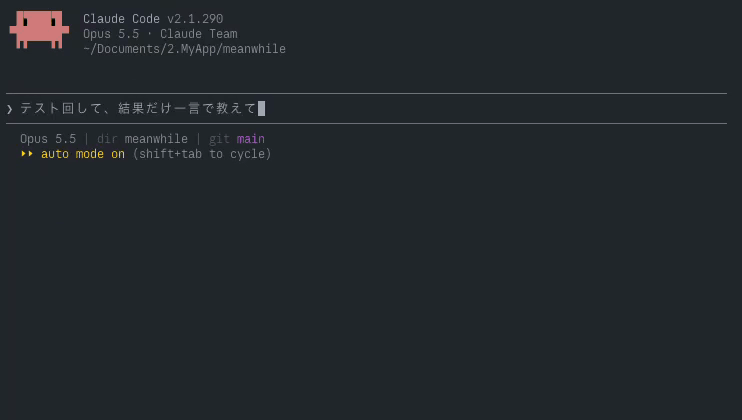

# Meanwhile

Claude Codeが作業している間だけ、同じく待っている誰かと匿名で1対1チャットできるmodです。別の窓は開かず、相手の発言は本体の入力欄の真上の帯に出て、自分の発言は本体の入力欄に`>> `で始めて送ります。相手の言語が違えばHaikuが自動で翻訳します。話し終わったら帯の[戻る]を押し、相手に「最後の一言」を1回だけ送って退室します。

*A Claude Code mod that pairs you with another waiting developer for an anonymous one-on-one chat while Claude is working. Messages in another language are translated by Haiku on the receiver's side, and you leave with one last word whenever you are ready to go back.*



動画(mp4): [media/meanwhile-demo.mp4](media/meanwhile-demo.mp4)

> **試験運用中です。** マッチングサーバーは`wss://meanwhile-match.jankovic.workers.dev`で動いています。

設計書: [docs/design.md](docs/design.md)

## 動き方

1. プロンプトを送ってから30秒(設定で変更可)たってもClaudeが作業中なら、相手を探し始めます。短いタスクでは何も起きません。
2. 相手が見つかると、本体の入力欄の真上の帯に「Someone · 英語 ⇄ 日本語」のように相手の言語が出ます。トーストでも知らせます。
3. 相手の発言は帯に、翻訳文を主に、原文を`│`付きの引用で並べて表示します。自分の発言は、本体の入力欄に`>> `(全角の`＞＞`も可)で始めて打つと、Claudeには渡らず相手に届きます。帯の「返信」を押すと、入力欄の先頭に`>> `が入ります。
4. 自分の作業が終わっても、会話はそのまま続きます。帯に「Claudeの作業が終わりました。話し終わったら[戻る]で戻れます」と出て、トーストでも知らせます。
5. 帯の[戻る]を押すと「最後の一言」の場面になり、制限時間(既定60秒)の間に`>> `で1通だけ送れます。送るかスキップすると退室します。[戻る]はClaudeの作業中でも押せます。
6. 相手が先に戻ると、相手の最後の一言と「Someoneは作業に戻りました」を表示し、自分がまだ作業中なら次の相手を探します。
7. 会話ログは退室と同時に消え、手元にも残りません。

Claudeが許可や回答を求めたときは、帯に一行出します。チャットはそのまま続けられます。

マッチ開始までの待ちと最後の一言の残り時間は、帯の導火線で表します。導火線は残り時間に合わせて縮み、尽きると次の段階に進みます。

## 構成

```
 ┌─ Claude Code ───────────────────┐
 │ mod(plugins/meanwhile)          │  状態遷移・入力欄の上の帯・受信文の無害化
 │   └ $.model.complete(Haiku)    │  受信側で翻訳(ツールなし・履歴なし)
 │        ▲ stdout(@mw JSON行)     │
 │        │ Unixソケット上のHTTP     │
 │ サイドカー(Node 22+, werift)     │  WebRTC・シグナリング・署名
 └────────┬────────────────┬──────┘
          │ WebSocket       │ WebRTC DataChannel(本文はここだけ)
          ▼                 ▼
 マッチングサーバー          相手のサイドカー
 (Cloudflare Worker + Durable Object)
   待機列・接続情報(SDP/ICE)の中継・通報の検証
```

modの実行環境にはソケットがないため、WebRTCとWebSocketはサイドカー(Nodeの子プロセス)が受け持ちます。サイドカーはmodが`$.process.spawn`で起動し、modが読み込み直されるかClaude Codeが終わると一緒に終わります。サイドカーの通信先は、マッチングサーバーとマッチした相手だけです。

マッチングサーバーは2人を組ませて接続情報を受け渡すだけで、本文は通りません。DataChannelがつながると、サイドカーはサーバーとのWebSocketを閉じます。

## 必要なもの

- Claude Code(modの読み込みに対応した版)
- Node.js 22以降(サイドカーの実行に使います。デスクトップアプリでも、ログインシェルの`PATH`から探します)
- macOSまたはLinux(サイドカーとの通信にUnixソケットを使うため、Windowsには未対応です)
- UDPで外へ出られるネットワーク(TURNを置いていないため、UDPが塞がれた環境ではつながりません)

## インストール

```
/plugin marketplace add jnk0vc/meanwhile
/plugin install meanwhile@meanwhile
```

マッチングサーバーは、公開中のもの(`wss://meanwhile-match.jankovic.workers.dev`)を最初から使います。自分で立てたサーバーを使うときは、`/config`でmeanwhileの`server`を書き換えます。

既定はオフです。`/meanwhile`を実行すると、入力欄の上の帯に同意画面が出ます。同意画面では次の6点を示します。

- 相手にはあなたのIPアドレスが見えること(直接つなぐため)
- 書いたことが匿名の相手に届くこと
- プロンプト・コード・ツールの出力は送らないこと
- 翻訳にあなたのClaudeの利用枠(Haiku)を使うこと
- 会話ログを残さないこと
- 18歳以上に限ること

`/meanwhile on`と`/meanwhile off`でも切り替えられます。

## 設定

| 設定(`/config`) | 既定値 | 選択肢 |
| --- | --- | --- |
| `server` | `wss://meanwhile-match.jankovic.workers.dev` | マッチングサーバーの起点(`wss://…`) |
| `matchDelay` | 30 | 5 / 15 / 30 / 45 / 60 / 90 / 120(秒) |
| `finalSeconds` | 60 | 30 / 60 / 90 / 120 / 180(秒) |
| `language` | auto | auto / ja / en / zh / ko ほか。autoはmacOSならシステム設定の言語、それ以外は`LANG` |
| `display` | both | both(翻訳＋原文)/ translated / original |
| `sound` | off | on / off |

有効化は帯の同意画面と`/meanwhile on|off`で行い、状態は`$.store`に保存します。同意を取ってから有効にするためです。

## 安全とプライバシー

見知らぬ人との匿名チャットなので、作業内容を漏らさないことと、嫌な相手からすぐ離れられることを優先しています。攻撃者はmodを使わない自作クライアントでも来られるため、守りはすべて受信側に置いています。

**作業内容を漏らさない**

- 送るのは、本体の入力欄に`>> `で始めて打った文だけです。人が入力欄に打ったもの(`origin`が`composer`)に限り、他のエージェントやタスク通知から届いたプロンプトは、`>> `で始まっていても送りません。つながっていないときは送らずに止め、Claudeにも渡しません。modはターンの始まりと終わりを知るためにフックを置いていますが、プロンプト・ツールの入出力・ファイルパス・リポジトリ名の中身は使いません(ツール呼び出しで見るのは、`AskUserQuestion`かどうかだけです)。
- 送信前に、APIキー・トークン・秘密鍵・メールアドレスらしき文字列を検出したら、送らずに下書きへ戻します。
- 相手に渡す接続情報(SDPとICE候補)から、LAN内のアドレスを消します。LAN内のアドレスそのものの候補(host)は送らず、外向きの候補に付く元のアドレス(`raddr`)は`0.0.0.0`に書き換えます。相手が通信を調べて分かるのは、外向きのIPアドレス(プロバイダやおおよその地域)だけです。
- 相手の文はClaude本体の文脈に入りません。帯はトランスクリプトに入らないので、Claudeは読まず、手元のファイルにも残りません。翻訳は`$.model.complete`による1回きりの補完で、ツール・履歴・プロジェクトの`CLAUDE.md`のどれも使いません。

**受信側の守り**

- 受信文から、ANSIエスケープ・制御文字・ゼロ幅文字・文字の向きを変える制御文字を除きます。
- `curl … | sh`、`npm install`、`npx`、長いBase64などコマンドらしい文には警告を付けます。コピーボタンは出しません。
- URLはリンクにせず、`https[:]//example[.]com`の形に崩して表示します。
- 翻訳のときは、相手の文をタグで囲んだデータとしてHaikuに渡し、中の指示には従わせません。Haikuが`flagged`と判定した文は伏せて表示します。同じ言語どうしではHaikuを呼ばず、手元のNGワードで判定します。
- サイドカーとmodの両方で、受信メッセージのスキーマ・サイズ(本文200文字まで)を検証し、未知の`type`は捨てます。相手からの受信は10秒に10通までです。

**嫌な相手から離れる**

- 表示名は全員「Someone」です。
- 発言にはEd25519で署名します。鍵はセッションごとに作り直し、インストールごとには固定しません。
- 通報・ブロックはワンクリックで即切断し、同じセッションの中では再びつながりません。直前の相手とも再マッチしません。
- 通報には相手の署名つき発言(最大20件)を添えます。サーバーは署名を検証したら発言を捨て、IPの塩つきハッシュごとの件数だけを残します。別々の3人から検証済みの通報が届いたIPと鍵は、24時間マッチングから外します。
- サーバーは`queue.join`に軽いproof-of-work(既定18ビット)を求め、IPごとに接続数と同時待機数を制限します。

## マッチングサーバー

`server/`はCloudflare Worker + Durable Objectです。待機列は言語を混ぜたFIFOの1本で、Durable Objectは世界に1つです。WebSocketはHibernation APIで受けるため、待機中の接続は課金されにくくなっています。

手元で動かす場合は次のとおりです。

```bash
npm --prefix server ci
npm run dev:server
```

このとき`server`の設定は`ws://127.0.0.1:8787`です。

Cloudflareへデプロイする場合は、IPのハッシュに使う塩をSecretに入れてからデプロイします。塩を入れなければ、Durable Objectが初回に作って保存します。

```bash
cd server
npx wrangler secret put IP_SALT
npx wrangler deploy
```

## 開発

```bash
npm run install:all   # サイドカーとサーバーの依存を入れる
npm run build         # サイドカーを plugins/meanwhile/sidecar/ に1ファイルでビルドする
npm run typecheck
npm test              # サーバー・サイドカー・modのテスト
npm run e2e           # wrangler devと本物のサイドカー3つで、マッチから最後の一言まで通す
```

### 手元での試運転

```bash
npm run dev:server                       # マッチングサーバーをws://127.0.0.1:8787で起動
scripts/dev-sync.sh ~/.claude/dev-mods/<セッションID>   # modを試運転用に写す
node scripts/peer.mjs --lang en          # 相手役。標準入力の1行がチャットになる
```

`scripts/dev-sync.sh`が写した先では、サーバーがローカルに向き、マッチ開始が5秒になり、開発用プレビューが有効になります(`dev.json`を置くため)。プレビューは`/meanwhile preview <状態>`か`mcp__meanwhile__preview`ツールで、サイドカーなしに帯を`chat`・`final`・`consent`などの状態にして描かせます。配布物には`dev.json`を含めないので、プレビューは出ません。

サイドカーのビルド結果(`plugins/meanwhile/sidecar/meanwhile-sidecar.mjs`)はリポジトリに含めます。インストールしたmodが`npm install`なしで動くようにするためです。依存はバージョンを固定し(`.npmrc`の`save-exact`)、自動更新しません。同梱した依存のライセンスは`meanwhile-sidecar.mjs.LEGAL.txt`にあります。

## 設計書との違い

実装の途中で、modの実行環境の制約に合わせて設計書から変えた点です。

- **翻訳の呼び方**: ヘッドレスのClaude Codeを起動する代わりに、`$.model.complete`でHaikuを呼びます。ツールなし・履歴なし・`CLAUDE.md`を読まない1回きりの補完なので、空の一時ディレクトリで起動するのと同じ隔離が得られます。費用は受信者自身の利用枠に乗ります。
- **WebRTCの置き場所**: modの環境にはソケットもNodeもないため、weriftはサイドカーで動かします。
- **プロトコルの追加**: サーバーは接続直後に`challenge`(proof-of-workの課題)を送り、`queue.join`は`pow`と`avoid`(避けたい相手の鍵)を持ちます。`match.found`には、署名を検証するための相手の公開鍵`peerKey`が付きます。
- **通報の送り先**: 会話中はWebSocketを閉じているため、通報は`POST /report`で送ります。
- **戻るタイミング**: 設計書ではClaudeの作業が終わったら「最後の一言」の場面に切り替えていましたが、会話が途中で打ち切られて短すぎたため、作業が終わっても会話を続け、本人が[戻る]を押したときに最後の一言の場面に入るようにしました。
- **会話の場所**: サイドパネルは開かず、相手の発言は本体の入力欄の真上の帯に、自分の発言は本体の入力欄から`>> `で送ります。パネルの入力欄はアプリ側で幅が固定されていて、日本語入力も考えると本体の入力欄を使う方が書きやすいためです。
- **締め出しの条件**: 「検証できた通報が重なった」を、別々の3人(IPのハッシュで区別)からの通報と決めました。

## 検証したこと

設計書の「検証すること」に対する結果です。

- [x] **weriftのDataChannel**: modの環境では動きません(ソケットがないため)。Node 24のサイドカーでは動き、ローカルのE2Eでマッチから接続まで約0.9秒でした。この時間には、STUNで外向きのアドレスを取る時間が含まれます(LAN内のアドレスを渡さないため)。
- [ ] **Haikuの応答速度**: `$.model.complete`での呼び出しはmodのテストで確かめました。実際のセッションでの応答速度はまだ測っていません。タイムアウトは5秒で、超えたら原文だけを表示します。
- [ ] **TURNなしでの接続成功率**: ローカルでしか試していません。

## 既知の制限

- Windowsでは動きません。
- LAN内のアドレスを渡さないため、同じLANにいる2人がマッチすると、ルーターがヘアピンNAT(外向きのアドレスで内側どうしを折り返す機能)に対応していなければつながりません。つながらなければ次の相手を探します。
- モバイルアプリでの帯の表示と`>> `での送信は、まだ確かめていません。
- 通報は「その相手が実際に送った発言か」を署名で確かめるだけで、内容の良し悪しは判定しません。別々の3人が示し合わせれば、無害な相手を24時間締め出せます。
- 同じ言語どうしのモデレーションは手元のNGワードだけで、語彙は最小限です。

## ライセンス

MIT
